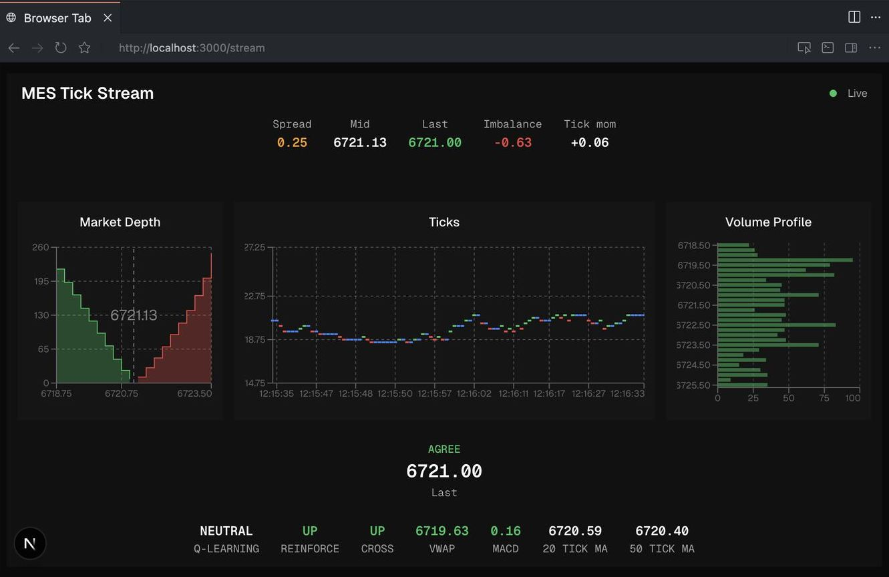

# ib-frontend

Next.js dashboard for live **MES** futures data from Interactive Brokers: ticks, volume, limit order book depth, and related market context (VIX, options payloads when provided by the upstream producer).



## How it works

1. A separate tick producer connects to IB and exposes a **TCP** server that emits **NDJSON** lines (one JSON object per line).
2. This app’s API route [`app/api/stream/route.ts`](app/api/stream/route.ts) opens that TCP socket and re-emits each line as **Server-Sent Events** (`text/event-stream`).
3. The [`/stream`](app/stream/page.tsx) page consumes the SSE feed in the browser and renders charts (Recharts), rolling stats (VWAP, moving average, MACD), and small in-browser demos for policy-gradient and tabular RL (`lib/reinforce.ts`, `lib/qlearning.ts`, `lib/agree.ts`).

No MQTT or message broker is required for the browser path.

## Interactive Brokers

Live data requires an **Interactive Brokers** account, **TWS or IB Gateway** with the API enabled, and **market data subscriptions** that cover the products you stream (for example, exchange fees and CME real-time entitlements apply for **MES** and related feeds). This app does not provide quotes; it only displays what your IB session and subscriptions allow the upstream producer to receive.

## Backend: [ib-interface](https://github.com/jxtngx/ib-interface)

The NDJSON tick producer is expected to come from the companion Python client in this lab. Clone [ib-interface](https://github.com/jxtngx/ib-interface) and use its README to install, connect to TWS/Gateway, and run the process that exposes the TCP stream this frontend reads.

```bash
git clone https://github.com/jxtngx/ib-interface.git
cd ib-interface
```

Then follow that repository’s setup (for example editable install with `uv` or `pip`) and any scripts or services that bind the stream to the host/port you set in **Configuration** below.

## Prerequisites

- Node.js 20+ (recommended for Next.js 16)
- Interactive Brokers account, API-enabled TWS/Gateway, and appropriate **data subscriptions** (see above)
- A tick stream process (from [ib-interface](https://github.com/jxtngx/ib-interface) or compatible NDJSON-over-TCP) listening on the host/port you configure

## Configuration

| Variable | Default | Description |
|----------|---------|-------------|
| `TICK_STREAM_HOST` | `127.0.0.1` | TCP host for the NDJSON tick producer |
| `TICK_STREAM_PORT` | `8765` | TCP port |

## Scripts

```bash
npm install
npm run dev      # Next dev with Turbopack
npm run build
npm run start
npm run lint
npm run typecheck
npm run format
```

## App routes

- **`/`** — Landing with link to the stream UI
- **`/stream`** — Live tick stream, volume profile, LOB depth, and derived indicators

## Stack

- [Next.js](https://nextjs.org/) 16 (App Router), React 19
- [Tailwind CSS](https://tailwindcss.com/) 4, [shadcn/ui](https://ui.shadcn.com/) components
- [Recharts](https://recharts.org/) for time series and profiles
- [React Three Fiber](https://docs.pmnd.rs/react-three-fiber) / Three.js for 3D scenes where used

## Adding UI components

This repo uses shadcn-style components under `components/ui`. To add more:

```bash
npx shadcn@latest add <component>
```

```tsx
import { Button } from "@/components/ui/button";
```
